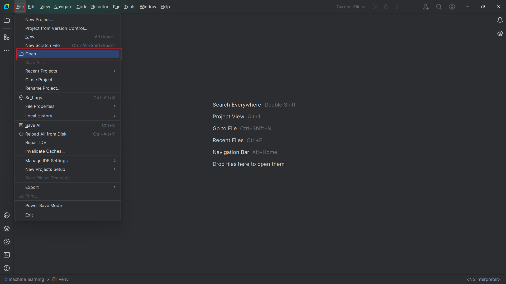
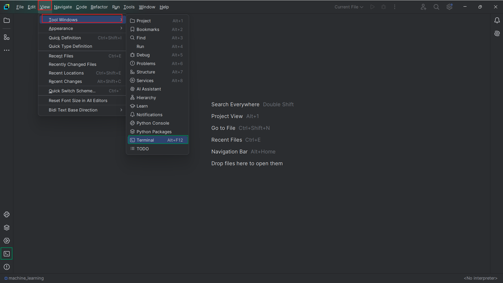
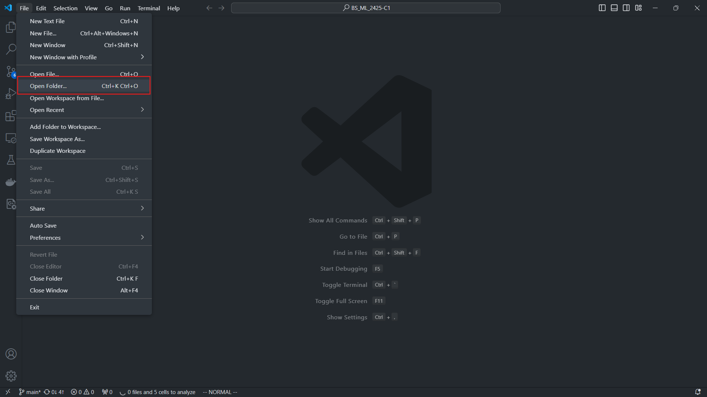
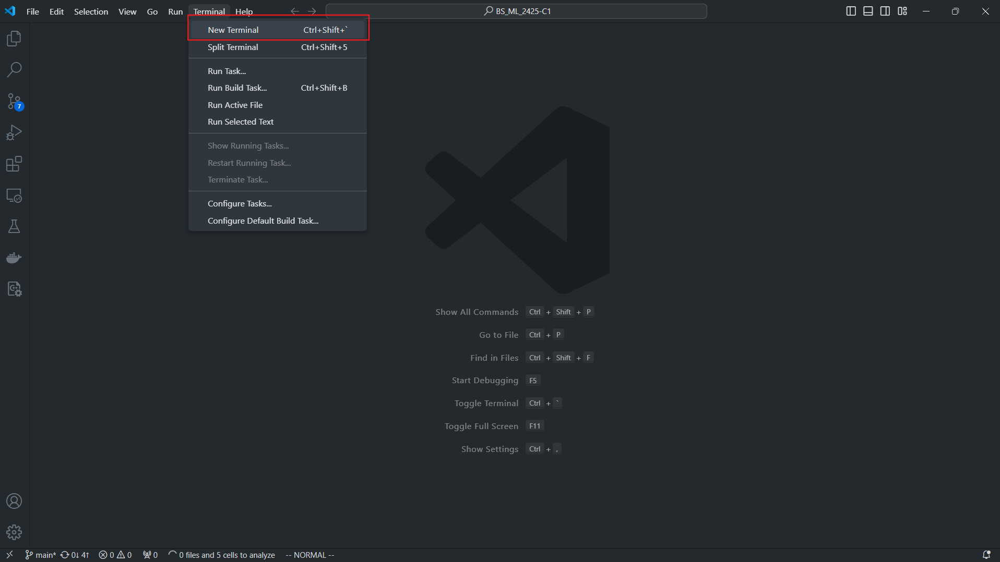

# როგორ გავუშვათ კოდი ლოკალურად?

### 1. ჩამოვტვირთოთ კოდი ლოკალურ სისტემაზე
```sh
git clone https://github.com/gau-uniwork/BS_ML_2425-C2.git

```

### 2. სამუშაო გარემოს გამართვა
- გავხსნათ სასურველი ედიტორი
- #### pycharm-ის მომხმარებლებმა
    - ზედა მარჯვენა კუთხეში მოვძებნოთ file > open და ავირჩიოთ ჩამოტვირთული რეპოზიტორის ფოლდერი:
    
    - გავხსნათ ტერმინალი: view > tool windows > terminal და შევქმნათ ვირტუალური გარემო:
    
- #### vscode-ის მომხმარებლებმა
    - ზედა მარცხენა კუთხეში მოვძებნოთ file > open folder და ავირჩიოთ ჩამოტვირთული რეპოზიტორის ფოლდერი
    
    - გავხსნათ ტერმინალი: terminal > new terminal და შევქმნათ ვირტუალური გარემო:
    
- ტერმინალის გახსნის შემდეგ შევქმნათ ვირტუალური გარემო:
```sh
python -m venv venv

# Windows
./venv/Scripts/activate.bat
## ან
./venv/Scripts/Activate.ps1
 
# unix
source ./venv/bin/activate
```
- და დავაინსტალიროთ საჭირო ბიბლიოთეკები:
```sh
pip install -r requirements.txt
```
- ნოუთბუქებთან სამუშაოდ:
```sh
jupyter notebook
```

# 3. ყოველი ლექციის შემდეგ განვაახლოთ ლოკალური რეპოზიტორი:
```sh
git pull
```
